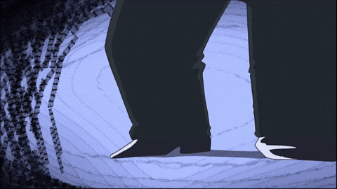

<!-- Banner / Header -->

  

<h1 align="center">Yo! I'm Ketan Goyal 👋</h1>
<h3 align="center">🚀 Full Stack Developer | 🌐 Web3 Enthusiast | 📚 Lifelong Learner</h3>

---

### 💡 About Me  
- 🔧 Builder who loves creating & breaking cool projects  
- 💻 Currently diving into **Blockchain • DevOps • AI/ML**  
- 🌱 Learning **Next.js • Prisma • PostgreSQL • Web3**  
- ⚡ Fun fact: I treat my deployed apps like sunsets 🌇  

---

### 🛠️ Tech Stack  

  

---

### 📊 GitHub Stats  

  
  

---

### 🎯 Featured Projects  
- 🔗 [**HackHeaven**](#) – Hackathon platform with auth, live coding & chat  
- 🔗 [**QuoteLoom**](#) – Social platform to share & follow quotes  
- 🔗 [**Blockchain RPS**](#) – Rock Paper Scissors with staking on Solana  

---

### 🌐 Connect With Me  

  
  
  
  

---

  

